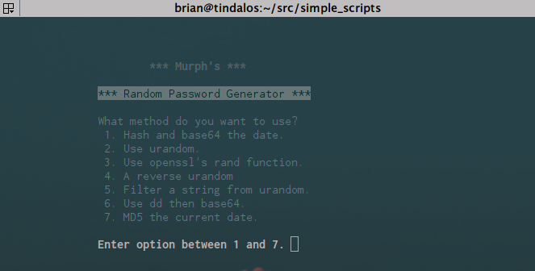

# simple_scripts
This is just a repo of some simple bash scripts that I have written...

* check_site -- Simple script to check is website is up via curl and then send me a push on PushBullet if it is down.
* git_ops -- Standard git update bs...
* pass_gen -- script to generate random pass in a few different methods (I added in tput commands to make it look a bit better but they still need to be tweaked for layout.)

